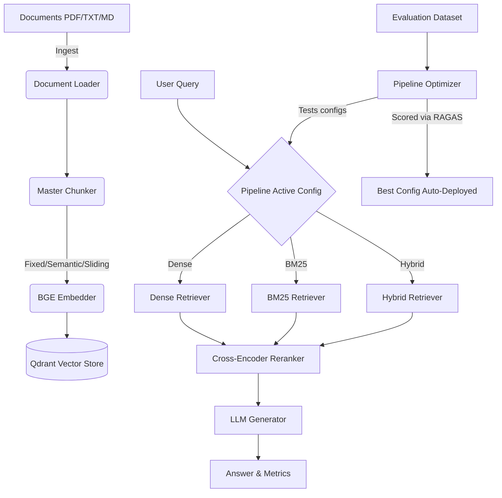

# AutoRAG-DevOps

A Retrieval-Augmented Generation (RAG) pipeline with a built-in optimizer that grid-searches retrieval strategies (dense, BM25, hybrid) and chunking configurations against an evaluation dataset, scored via RAGAS, to pick the best-performing configuration.

Modular architecture: swappable retrievers, chunkers, and rerankers behind a FastAPI backend, with a Streamlit dashboard for ingestion, querying, and pipeline diagnostics.

---

## 🏗 Architecture Flow



## 🚀 Key Features

*   **Multi-Retriever System**: Switch seamlessly between Dense, Sparse (BM25), and Hybrid retrieval.
*   **Dynamic Chunking**: Configurable chunking rules including Naive Fixed, Semantic breakpoints, and token-based Sliding Windows.
*   **Pipeline Optimizer**: Grid-searches components, evaluated locally with RAGAS metrics (Faithfulness, Recall, Precision, Relevance) to find the optimal deployment config.
*   **Streamlit UI**: Full diagnostic view of the pipeline flow, ingestion controls, and evaluation tools.

## 💻 Tech Stack

- **Core**: Python 3.11, FastAPI
- **RAG & Gen**: LangChain, OpenAI (`gpt-3.5-turbo`), BAAI `bge-small-en-v1.5`
- **Retrieval/Store**: Qdrant, `rank_bm25`, `ms-marco-MiniLM` cross-encoder reranker
- **Eval**: RAGAS
- **Ops**: Docker, GitHub Actions, Streamlit

## ⚠️ Current status: CI/CD is scaffolded, not wired up yet

`.github/workflows/rag_test.yml` and `deploy.yml` exist and define the intended pipeline (install deps, run tests, run a RAGAS regression check, build/push/deploy on tag), but the test and evaluation steps are currently placeholder `echo` commands, and `tests/` has no test files yet. This is stated plainly here rather than left for someone to discover by opening the workflow file and finding it does nothing. Turning these into real, running steps (actual pytest suite, a real golden-dataset RAGAS threshold check) is the next real piece of work on this project, not something already done.

---

## 🛠 Setup Instructions

### Prerequisites
1. Python 3.11+
2. Qdrant running locally (Docker recommended)
3. OpenAI API Key

### Local Installation

1. Clone repo:
    ```bash
    git clone https://github.com/soobhanu55/AutoRAG-DevOps.git
    cd AutoRAG-DevOps
    ```

2. Install dependencies:
    ```bash
    pip install -r requirements.txt
    ```

3. Setup environment variables:
    Create a `.env` file in the root directory:
    ```env
    OPENAI_API_KEY=sk-...
    QDRANT_HOST=localhost
    QDRANT_PORT=6333
    ```

4. Run local Qdrant container:
    ```bash
    docker run -p 6333:6333 -p 6334:6334 qdrant/qdrant
    ```

### ▶️ Running Locally (Development)

**1. Start the FastAPI Backend:**
```bash
uvicorn backend.main:app --reload
```
API runs on `http://localhost:8000`. Swagger UI at `http://localhost:8000/docs`.

**2. Start the Streamlit Dashboard:**
```bash
streamlit run dashboard/streamlit_app.py
```
Dashboard runs on `http://localhost:8501`.

---

## 🐳 Docker

To build and run the entire application using Docker:
```bash
docker build -t autorag-devops .
docker run -p 8000:8000 autorag-devops
```

`.github/workflows/deploy.yml` sketches out a build-push-deploy pipeline (Docker Hub + SSH to a server) but the deploy step's server commands are commented out and the Docker Hub repo referenced is a placeholder — it documents an intended deployment path, not a live one.

---

## ❓ Example Queries

1. Ingest documents via the dashboard or using curl:
```bash
curl -X 'POST' \
  'http://localhost:8000/ingest?strategy=fixed' \
  -H 'accept: application/json' \
  -H 'Content-Type: multipart/form-data' \
  -F 'file=@sample.pdf'
```

2. Query the system:
```bash
curl -X 'POST' \
  'http://localhost:8000/query' \
  -H 'accept: application/json' \
  -H 'Content-Type: application/json' \
  -d '{
  "query": "What are the key features of this architecture?",
  "top_k": 5
}'
```
